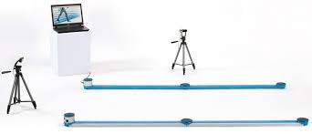
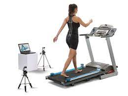

# OptogaitPredictor
The main goal was to create a trained model using data collected from patients who underwent a series of tests conducted by a commonly used instrument in the field: Optogait. This device acquires information such as step length, time the feet spend in the air, foot swing, and more.

The project aimed to find the optimal model among those trained with various machine learning algorithms using R and Python along with their respective libraries. Once identified, an additional step involved the development of a web application using R, RShiny, JS, HTML, and CSS. This application allows for predicting the pathology of new patients by inputting data gathered with Optogait.

## Optogait Hardware
Optogait is composed of a transmitting optical bar and a receiving one. Each one contains 96 Infrared LEDs. These LEDs are positioned on the transmitting bar and communicate continuously with the LEDs on the receiving bar. The system detects any interruptions and their duration.

## Setup instructions
The model included in the repository is the last one specified in the memory, resolving a binary class problem, whether the patient has plantar fasciitis or not.

### R dependencies
R version 4.3.1 (2023-06-16 ucrt)

**For Web app**   
shinycssloaders_1.0.0
shinyjs_2.1.0
dplyr_1.1.2
survminer_0.4.9
ggpubr_0.6.0         
survival_3.5-7
readr_2.1.4
readxl_1.4.3
ggplot2_3.4.3
shinyWidgets_0.7.6   
shinydashboard_0.7.2
DT_0.28
reticulate_1.31
shiny_1.7.5

**For pre-processing and training the models**  
mlr3pipelines_0.5.0-9000
BBmisc_1.13
mlr3tuning_0.19.0.9000
paradox_0.11.1-9000
mlr3viz_0.6.1.9000
mlr3learners_0.5.6
mlr3_0.16.1-9000
corrplot_0.92
Hmisc_5.1-0
Matrix_1.6-1
normalr_1.0.0 
nnet_7.3-19
rjson_0.2.21
stringr_1.5.0
tidyr_1.3.0             
MASS_7.3-60

### Python dependencies
Install requirements.txt

## Optional Scripts to see results described in *Project_Memory.pdf* 
### R/T1.Rmd
Unfortunately, due to privacy reasons, pre-processing done in RStudio ( First part of *T1.Rmd* file) is not reproducible, however we provide the final file obtained: *OptoDF.csv*

Second part of *T1.Rmd* (From lines 498-748) are different ML algorithms applied to the previosuly mentioned dataframe for study reasons.

### Python/ProcesamientoJupyter.ipynb
This python Notebook uses *OptoDF.csv*. After installing all dependencies you should be able to replicate it.

--------------

### Web Application
1. Install Web App R dependencies (It is recommended to install them all)
2. Go to OptogaitPredictor/OptoBelopApp
3. Open *Launcher_App.R* with RStudio.
4. Update the path in the second line to the absolute path where you have that script (*Launcher_App.R*)
5. Click Run App.
6. You have five fake patients data to try the program in PacientesInput folder.
7. For more information open *Project_Memory.pdf*

